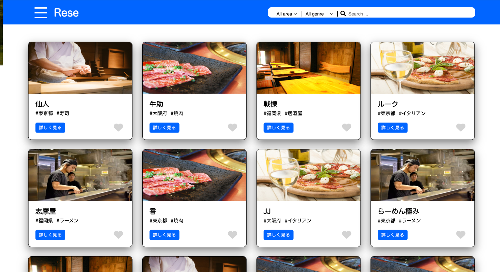
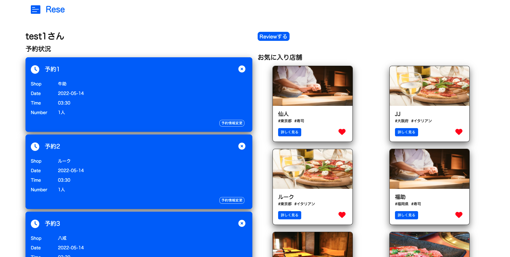

# 店舗予約アプリ
ある企業のグループ会社の飲食店予約サービス
 

## 機能一覧

- [x] 会員登録
- [x] ログイン
- [x] ログアウト
- [x] パスワードリセット
- [x] メール認証
- [x] ユーザー情報取得
- [x] ユーザー飲食店お気に入り一覧取得
- [x] ユーザー飲食店予約情報取得
- [x] 飲食店一覧取得
- [x] 飲食店詳細取得
- [x] 飲食店お気に入り追加
- [x] 飲食店お気に入り削除
- [x] 飲食店予約情報追加
- [x] 飲食店予約情報削除
- [x] エリアで検索する
- [x] ジャンルで検索する
- [x] 店名で検索する
- [x] 予約情報編集
- [x] レビュー投稿
- [x] レビュー編集
- [x] レビュー削除
- [ ] 管理者ログイン
- [ ] 管理者が店舗代表者を作成
- [ ] 管理者が新規店舗を追加
- [ ] 店舗代表者ログイン
- [ ] 店舗代表者が担当店舗情報の編集
- [ ] 店舗代表者が新規コース作成
- [ ] 店舗代表者がコース編集
- [ ] 店舗代表者がコース削除
- [ ] 店舗代表者が予約者へ個別メール送信
- [ ] 店舗代表者が予約者へ全体メール送信
- [ ] 店舗代表者QRコード読み取り
- [ ] ユーザーQRコード表示
- [ ] ユーザーStripe決済
- [ ] 店舗画像・コース画像S3へ保存
- [ ] 予約当日リマインダー機能
- [ ] push時自動テスト（circleci）
 
 

 
 

## 環境構築
- git clone https://github.com/keisukefukuchi/rase.git
- composer update
- cp .env.example .env
- データベース設定
- php artisan key:generate
- メール認証の設定
- php artisan migrate:fresh
- php artisan storage:link
- php artisan db:seed
- php artisan serve
