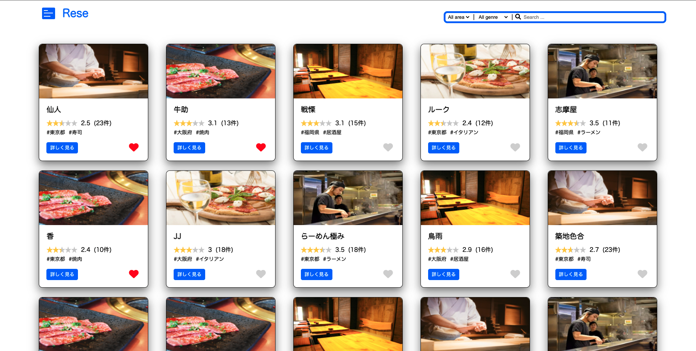

# 店舗予約アプリ
ある企業のグループ会社の飲食店予約サービス
 
## 機能一覧
-[] 会員登録
-[] ログイン
-[] ログアウト
-[] ユーザー情報取得
-[] ユーザー飲食店お気に入り一覧取得
-[] ユーザー飲食店予約情報取得
-[] 飲食店一覧取得
-[] 飲食店詳細取得
-[] 飲食店お気に入り追加
-[] 飲食店お気に入り削除
-[] 飲食店予約情報追加
-[] 飲食店予約情報削除
-[] エリアで検索する
-[] ジャンルで検索する
-[] 店名で検索する
-[] 予約情報編集
-[] レビュー投稿
-[] レビュー編集
-[] レビュー削除
-[] 管理者ログイン
-[] 管理者が店舗代表者を作成
-[] 管理者が新規店舗を追加
-[] 店舗代表者ログイン
-[] 店舗代表者が担当店舗情報の編集
-[] 店舗代表者が新規コース作成
-[] 店舗代表者がコース編集
-[] 店舗代表者がコース削除
-[] 店舗代表者が予約者へ個別メール送信
-[] 店舗代表者が予約者へ全体メール送信
-[] 店舗代表者QRコード読み取り
-[] ユーザーQRコード表示
-[] ユーザーStripe決済
-[] 店舗画像・コース画像S3へ保存
-[] 予約当日リマインダー機能
-[] push時自動テスト（circleci）

 
 

## 環境構築
- git clone https://github.com/keisukefukuchi/rase.git
- composer update
- cp .env.example .env
- データベース設定
- php artisan key:generate
- メール認証の設定
- php artisan migrate:fresh
- php artisan storage:link
- php artisan db:seed
- php artisan serve
